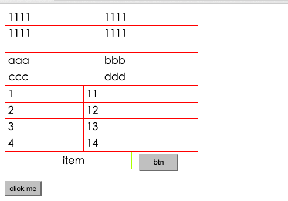
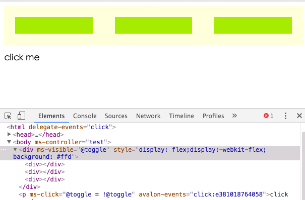
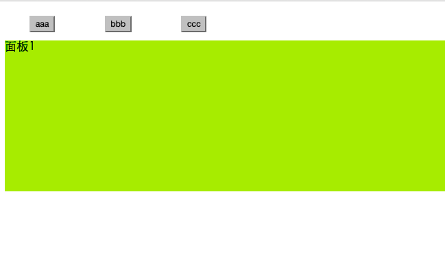

#显示隐藏处理
#vvisible manipulating
今天的主角是ms-visible，它的效果类拟于jQuery的toggle，如果它后面跟着的表达式为真值时则显示它所在的元素，为假值时则隐藏。不过显示不是 display:none这么简单，众所周知，display拥有inline, inline-block, block, list-item, table, table-cell等十来个值，比如用户之前是让此LI元素表示inline-block，实现水平菜单效果，你直接display:block就会撑破布局。因此元素之前是用什么样式显示，需要保存下来，当表达式转换为真值时再还原。  
we are talking about ms-visible today,it works very samilarly to the jQuery toggle(),if ms-visible is set a true Expression,the element will display,otherwise it will disapper.This attr does not only toggle your element between display:none and display:block, we all know that dispaly attr has many oppional values:inline, inline-block, block, list-item, table, table-cell ETC, you can't simply toggle your element between display:none and display:block otherwise your element may not display correctly.The original display value must be saved for restoring your element the original style when ms-visible:true.  
```
<!DOCTYPE html>
<html>
    <head>
        <title>TODO supply a title</title>
        <meta charset="UTF-8">
        <meta name="viewport" content="width=device-width">
        <script src="./dist/avalon.js"></script>
        <script >
            var vm = avalon.define({
                $id: "test",
                toggle: false,
                array:[1,2,3,4]
            })
          
        </script>
        <style>
            table{
                width:300px;
                border-collapse: collapse;
                border:1px solid red;
            }
            td {
                padding:5px;
                border:1px solid red;
            }
            .menu{
                display:inline-block;
                *display:inline;
                *zoom:1;
                width:140px;
                padding:5px 20px;
                text-align: center;
                margin-left:1em;
                border: 1px solid greenyellow;
            }
            .btn{
                padding:5px 20px;
                margin-left:1em;
                display: inline-block;
            }
        </style>
    </head>
    <body ms-controller="test" >
        <table ms-visible="@toggle" border="1" >
            <tr ms-visible="@toggle"><td>1111</td><td>1111</td></tr>
            <tr><td>1111</td><td>1111</td></tr>
        </table>
        <br/>
        <table border="1" >
            <tr ms-visible="@toggle"><td >aaa</td><td>bbb</td></tr>
            <tr><td ms-visible="@toggle">ccc</td><td>ddd</td></tr>
        </table>
        <table border="1" >
            <tr ms-for="el in @array">
                <td ms-visible="@toggle">{{el}}</td>
                <td ms-visible="@toggle">{{el+10}}</td>
            </tr>
        </table>
        <div style="display:none" class="menu" ms-visible="@toggle">item</div>  
        <button style="display:none" class="btn" type="button" ms-visible="@toggle">btn</button> 
        <p><input type="button" ms-click="@toggle = !@toggle" value="click me"></p>
    </body>
</html>
```  
  
这里用到ms-for循环指令及ms-click事件指令，语法与ng没有二致，不懂可以暂时忽略。  
this example use ms-for loop directive and ms-click event diretive,the grammar is exactly the same as ng,you may skip this if you don‘t know diretives.

再看它能否处理内联样式的干扰：  
let‘s see if it can precede over a inline style:  
```
<!DOCTYPE html>
<html>
    <head>
        <title>TODO supply a title</title>
        <meta charset="UTF-8">
        <meta name="viewport" content="width=device-width">
        <script src="./dist/avalon.js"></script>
        <script >
            var vm = avalon.define({
                $id: "test",
                toggle: true
            })
          
        </script>
        <style>
            div div{
                flex:1;
                margin: 20px;
                height: 30px;
                background: #a9ea00;
            }
        </style>
    </head>
    <body ms-controller="test" >
        <div ms-visible="@toggle" style="display: flex;display:-webkit-flex;background: #ffd">
            <div></div> <div></div> <div></div>
        </div>
        <p ms-click="@toggle = !@toggle">click me</p>
    </body>
</html>
```
  
我们再来一个有用的例子，做一个切换卡。
a useful example,tab switcher  
```
<!DOCTYPE html>
<html>
    <head>
        <title>TODO supply a title</title>
        <meta charset="UTF-8">
        <meta name="viewport" content="width=device-width">
        <script src="./dist/avalon.js"></script>
        <script >
            var vm = avalon.define({
                $id: "test",
                curIndex: 0, //默认显示第一个
                buttons: ['aaa', 'bbb', 'ccc'],
                panels: ["<div>面板1</div>", "<p>面板2</p>", "<strong>面板3</strong>"]
            })

        </script>
        <style>
            button{
                margin:1em 3em;
            }
            .panel div{
                height:200px;
                background: #a9ea00;
            }
            .panel p{
                height:200px;
                background: green;
            }
            .panel strong{
                display:block;
                width:100%;
                height:200px;
                background: #999;
            }
        </style>
    </head>
    <body ms-controller="test" >
        <div>
            <button ms-for='(i, el) in @buttons' ms-click='@curIndex = i'>{{el}}</button>
        </div>
        <div class='panel' ms-for='(jj, el) in @panels' ms-visible='jj === @curIndex' ms-html='el'></div>
    </body>
</html>
```
  
